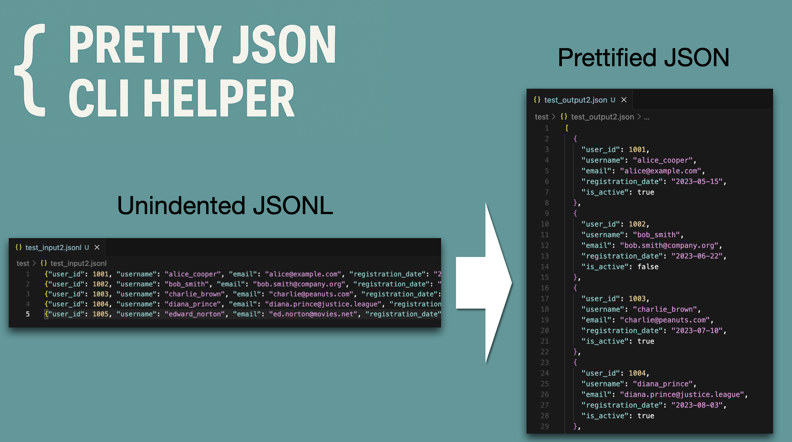

# Pretty JSON CLI

A simple Python command-line tool for pretty-printing JSON and JSONL files.

## Features

- Pretty-print JSON files with proper indentation
- Convert JSONL (JSON Lines) files to formatted JSON arrays
- Output to terminal or save to file
- UTF-8 encoding support with proper error handling

## Requirements

- Python 3.8+
- No external dependencies (uses Python standard library only)

## Installation

### Method 1: Direct Usage

```bash
git clone https://github.com/jaekookang/pretty_json.git
cd pretty_json
chmod +x pretty_json.py
python pretty_json.py input.jsonl
```

### Method 2: System-wide Installation

```bash
git clone https://github.com/jaekookang/pretty_json.git
cd pretty_json
chmod +x pretty_json.py

# Create symlink in your PATH (adjust path as needed)
ln -s $(pwd)/pretty_json.py ~/bin/pretty_json
```

## Usage

### Basic Usage

```bash
# Pretty-print to terminal
python pretty_json.py input.jsonl
# or if installed system-wide:
pretty_json input.jsonl

# Save to file
python pretty_json.py input.jsonl --output output.json
pretty_json input.jsonl -o output.json
```

### Examples

**Input JSONL file (input.jsonl):**

```json
{"name": "Alice", "age": 30}
{"name": "Bob", "age": 25}
```

**Output:**

```json
[
  {
    "name": "Alice",
    "age": 30
  },
  {
    "name": "Bob",
    "age": 25
  }
]
```

## Python Environment Setup

### Using Conda (Recommended)

```bash
# Create new environment
conda create -n pretty_json python=3.12
conda activate pretty_json

# Or use base environment
conda activate base
```

### Using venv

```bash
python -m venv venv
source venv/bin/activate  # On Windows: venv\Scripts\activate
```

## Development

### Running Tests

```bash
# Test with provided sample files
python pretty_json.py test/test_input.jsonl
python pretty_json.py test/test_input.jsonl -o test_output.json
```

### File Structure

```
pretty_json/
    pretty_json.py      # Main executable
    test/
        test_input.jsonl
        test_output.json
    README.md
    requirements.txt
```

## Error Handling

- Invalid JSON syntax errors are reported with line numbers
- Missing input files are handled gracefully
- Output file write permissions are checked

## License

MIT License - feel free to use and modify as needed.
